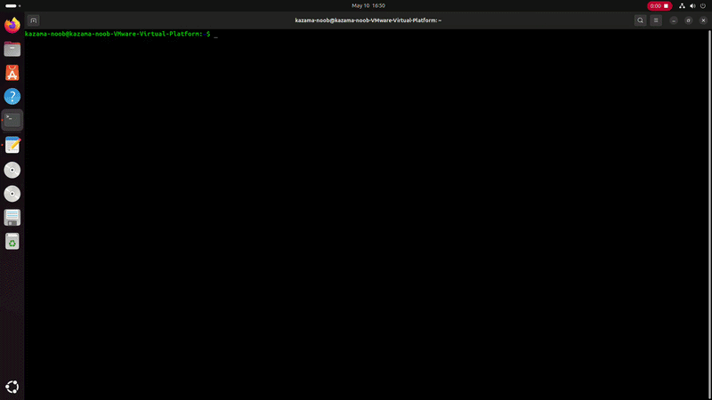

# Hardened Linux Password Manager (CLI)



A locally hardened, zero-knowledge credential vault engineered natively for Linux environments, bridging cryptographic integrity with operating-system-level memory protections.

## 🛡️ Security Architecture

### 1. Cryptographic Primitives
* **Key Derivation (KDF):** Uses `PBKDF2-HMAC-SHA256` with **480,000 iterations** to derive a 256-bit AES key from the master password, creating massive computational friction against offline brute-force attacks.
* **Symmetric Encryption:** Implements Authenticated Encryption with Associated Data (**AES-256-GCM**). This mode guarantees both data confidentiality and cryptographic data-integrity checks, completely neutralizing bit-flipping attacks.
* **Entropy Source:** Generates cryptographic salts (16 bytes) and initialization vectors (12 bytes) using system-level entropy via the Linux kernel CSPRNG (`os.urandom`).

### 2. Linux OS-Level Memory Hardening
* **Anti-Swap Protection (`mlockall`):** Binds into native Linux C library structures (`libc.so.6`) via Python `ctypes` to lock the application memory pages into physical RAM. This strictly prevents the Linux kernel from writing unencrypted keys or plaintext passwords out to a local disk swap partition.
* **Core Dump Mitigation (`setrlimit`):** Configures `RLIMIT_CORE` to zero bytes at the process entry point. If the application suffers a catastrophic system crash, the kernel is forced to discard the process memory map, stopping plaintext credential remnants from leaking into disk crash dumps.

### 3. Ephemeral Clipboard Integration
* **Subprocess Isolation:** Interfaces natively with the Wayland display server (`wl-copy`), passing arguments as explicit parameter vectors to eliminate shell code-injection vulnerabilities.
* **Asynchronous Auto-Wipe:** Spawns a decoupled background daemon worker thread to track a 20-second expiration window. Once expired, it triggers a system clear directive (`wl-copy -c`) to scrub plaintext secrets out of the OS copy-paste buffer.

## 🚀 Getting Started

### Prerequisites
Ensure you are on a Linux distribution running a Wayland display server (e.g., modern Ubuntu) and have `wl-clipboard` installed:
```bash
sudo apt update && sudo apt install wl-clipboard -y
```

### Execution
Run the secure script with elevated capabilities to enable memory-locking page allocations:
```bash
sudo python3 password_manager.py
```
